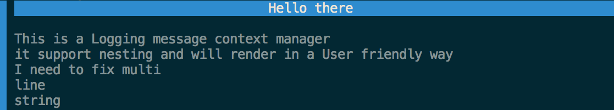
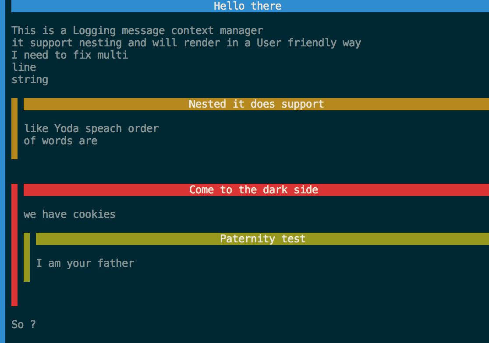

# Withlog

Logging as a context manager. 

Visually inspired by how [Credo](https://github.com/rrrene/credo) looks like, I
always find difficult to communicate with user in command line interface.  So
this is a logging/printing system which is more block based than line base, and
with color also.


The following will show a nice formatted message :

```python
with Message('Hello there') as log:
    log('This is a Logging message context manager')
    log('it support nesting and will render in a User friendly way')
    log('I need to fix multi \nline \nstring')
```




You can nest these:

```python
with Message('Hello there') as log:
    log('This is a Logging message context manager')
    log('it support nesting and will render in a User friendly way')
    log('I need to fix multi \nline \nstring')
    with Warning('Nested it does support') as log1:
        log1('like Yoda speach order ')
        log1('of words are')

    with Critical('Come to the dark side') as log2:
        log2('we have cookies')

        with OK("Paternity test") as log3:
            log3('I am your father')

```

To get nested messages:



